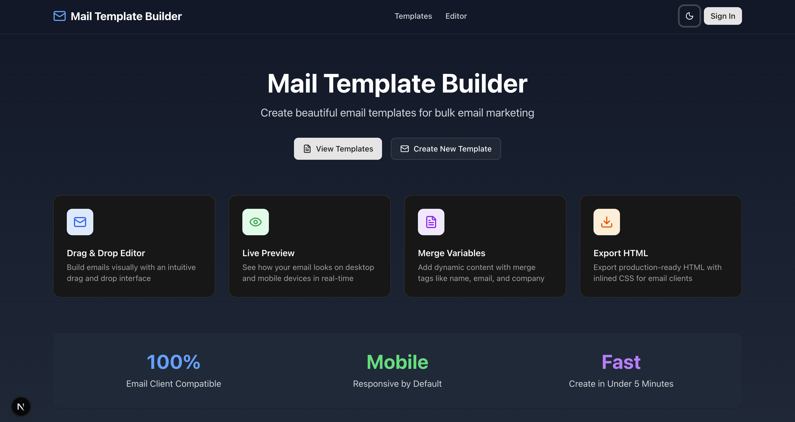
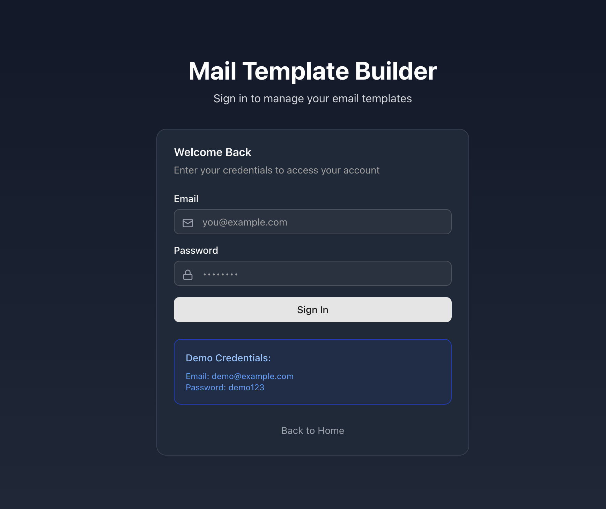
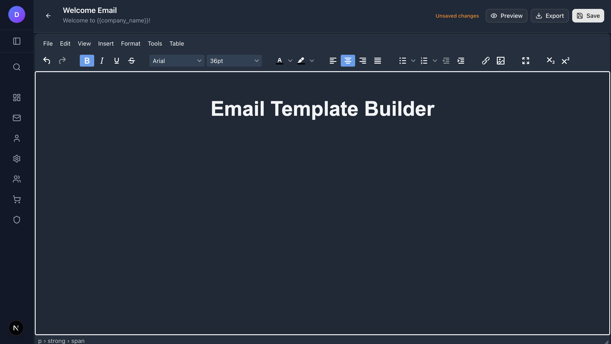
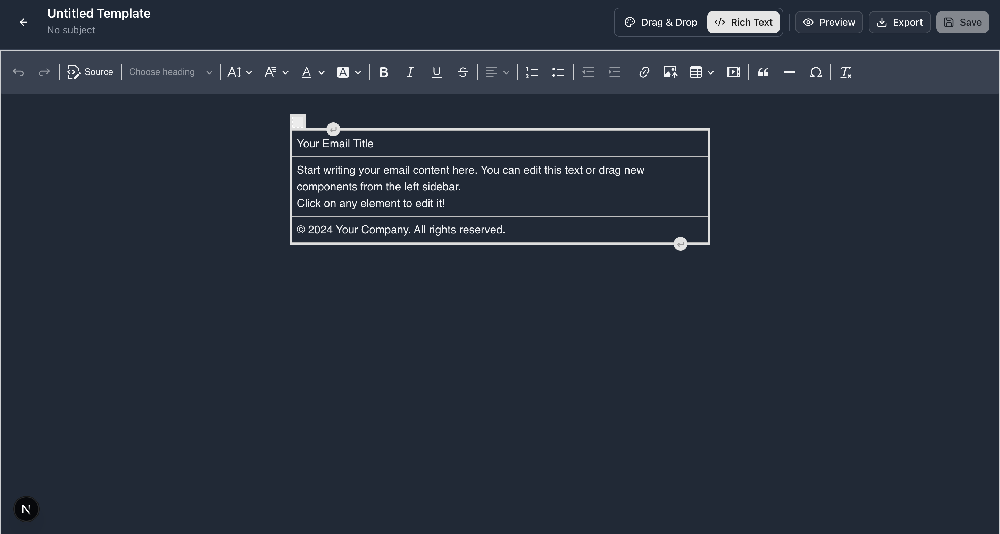

# Mail Template Builder

A modern, feature-rich email template builder designed for bulk email marketing campaigns. Built with Next.js 16, TypeScript, and TinyMCE rich text editor.


## 📋 Overview

Mail Template Builder is a comprehensive web application that enables users to create, edit, and manage professional email templates for marketing campaigns. The application features a powerful TinyMCE rich text editor with image upload capabilities, providing users with a professional WYSIWYG editing experience.

### Key Highlights

- 📝 **TinyMCE Editor**: Professional rich text editor with full formatting capabilities
- 🌓 **Dark Mode**: Full dark mode support with automatic system detection and TinyMCE theme integration
- 📱 **Responsive Design**: Works seamlessly across desktop and mobile devices
- 🔐 **Authentication**: Secure user authentication with enhanced login UI
- 💾 **File-based Storage**: Simple JSON-based template storage
- 🎯 **Merge Tags**: Support for dynamic variables like `{{name}}`, `{{email}}`, `{{company}}`
- 📤 **Export Functionality**: Export templates as standalone HTML files
- 👁️ **Live Preview**: Real-time preview of your email templates
- 🎨 **Modular Components**: Clean, maintainable codebase with separated UI components

## 📸 Screenshots

### Homepage

*Clean and modern landing page with clear call-to-action*

### Templates Management

*Organize and manage all your email templates in one place*

### Email Editor Interface

*Powerful TinyMCE rich text editor with full formatting capabilities*

### Dark Mode Support

*Full dark mode support with automatic system detection and editor theme integration*

## ✨ Features

### Template Management
- **Create & Edit**: Build email templates from scratch or edit existing ones
- **Categorization**: Organize templates by category (Newsletter, Marketing, Transactional, etc.)
- **Tagging System**: Add custom tags for easy filtering and organization
- **Duplicate Templates**: Quickly create copies of existing templates
- **Search & Filter**: Find templates quickly with built-in search functionality

### Rich Text Editor (TinyMCE 7.6.0)
- **WYSIWYG Editing**: What you see is what you get
- **Image Upload**: Direct image upload with server storage
- **Rich Formatting**: Bold, italic, underline, strikethrough, fonts, colors
- **Tables & Lists**: Create structured content with tables and lists
- **Source Editing**: Switch to HTML source code view
- **Media Embed**: Embed external media content
- **Special Characters**: Insert symbols and special characters
- **Dark Mode Support**: Automatic theme switching based on system preference
- **No Promotion Banner**: Clean interface without upgrade prompts
- **Email-optimized**: Settings configured for email compatibility

### User Interface
- **Modern Design**: Clean, intuitive interface built with Tailwind CSS v4
- **Dark Mode**:
  - Light theme
  - Dark theme
  - System auto-detection
  - Persistent theme preference
  - TinyMCE editor theme integration
- **Responsive Layout**: Optimized for all screen sizes
- **shadcn/ui Components**: Beautiful, accessible UI components
- **Modular Sidebar**:
  - Collapsible navigation
  - Animated dropdown menus
  - User profile menu with settings
  - Search functionality
  - Dark mode toggle
  - Language switcher (EN/ID)
- **Enhanced Login**:
  - Show/hide password toggle
  - Consistent input heights
  - Clean focus states (no outline)
  - Better UX with larger touch targets

### Authentication & User Management
- **Secure Login**: Email and password authentication with enhanced UI
- **Protected Routes**: Automatic redirection for unauthenticated users
- **User Profile**: Modular profile page with stats and quick actions
- **Persistent Sessions**: Stay logged in across browser sessions

## 🛠️ Tech Stack

### Frontend
- **[Next.js 16.0.0](https://nextjs.org/)** - React framework with App Router
- **[TypeScript 5.x](https://www.typescriptlang.org/)** - Type-safe JavaScript
- **[Tailwind CSS v4](https://tailwindcss.com/)** - Utility-first CSS framework
- **[React 19.2.0](https://react.dev/)** - UI library

### Editor
- **[TinyMCE 7.6.0](https://www.tiny.cloud/)** - Professional rich text WYSIWYG editor
- **[@tinymce/tinymce-react 5.1.1](https://www.tiny.cloud/docs/tinymce/latest/react-ref/)** - React integration

### State Management
- **[Zustand 5.0.8](https://zustand-demo.pmnd.rs/)** - Lightweight state management
- **[zustand/middleware](https://github.com/pmndrs/zustand)** - Persistence middleware

### UI Components
- **[shadcn/ui](https://ui.shadcn.com/)** - Reusable component library
- **[Radix UI](https://www.radix-ui.com/)** - Accessible primitives
- **[Lucide React](https://lucide.dev/)** - Icon library

### Utilities
- **[date-fns](https://date-fns.org/)** - Date manipulation
- **[react-hot-toast](https://react-hot-toast.com/)** - Toast notifications

## 🚀 Getting Started

### Prerequisites

- **Node.js**: 18.x or higher
- **npm**: 9.x or higher (or yarn/pnpm/bun)

### Installation

1. **Clone the repository**
   ```bash
   git clone <repository-url>
   cd mail-template-builder
   ```

2. **Install dependencies**
   ```bash
   npm install --legacy-peer-deps
   # or
   yarn install
   # or
   pnpm install
   ```

3. **TinyMCE files will be copied automatically** during `postinstall` script

4. **Run the development server**
   ```bash
   npm run dev
   ```

5. **Open your browser**

   Navigate to [http://localhost:3000](http://localhost:3000)

### First Time Setup

1. **Access the login page**: Navigate to `/login`
2. **Use demo credentials**:
   - Email: `demo@example.com`
   - Password: `demo123`
3. **Start creating templates**: Click "Create Template" to begin

## 📁 Project Structure

```
mail-template-builder/
├── src/
│   ├── app/                      # Next.js App Router pages
│   │   ├── api/                  # API routes
│   │   │   ├── templates/        # Template CRUD operations
│   │   │   └── upload/           # File upload endpoint
│   │   ├── editor/               # TinyMCE email editor page
│   │   ├── login/                # Enhanced login page
│   │   ├── profile/              # Modular user profile page
│   │   ├── templates/            # Templates listing page
│   │   ├── layout.tsx            # Root layout with ThemeProvider
│   │   ├── page.tsx              # Homepage
│   │   └── globals.css           # Global styles with dark mode
│   │
│   ├── components/               # React components
│   │   ├── auth/                 # Authentication components
│   │   │   ├── ProtectedRoute.tsx
│   │   │   └── UserMenu.tsx
│   │   ├── editor/               # Editor components
│   │   │   ├── TinyMCEComponent.tsx  # TinyMCE wrapper with dark mode
│   │   │   └── EditorToolbar.tsx     # Editor controls
│   │   ├── layout/               # Layout components (modular)
│   │   │   ├── Sidebar.tsx           # Main sidebar component
│   │   │   ├── SidebarHeader.tsx     # Header with avatar & toggle
│   │   │   ├── SidebarUserMenu.tsx   # User dropdown menu
│   │   │   ├── SidebarSearch.tsx     # Search input
│   │   │   ├── SidebarMenuItem.tsx   # Menu item with submenu
│   │   │   ├── SidebarFooter.tsx     # Footer info
│   │   │   ├── menuItems.ts          # Menu configuration
│   │   │   └── AppLayout.tsx         # Layout wrapper
│   │   ├── profile/              # Profile page components (modular)
│   │   │   ├── ProfileHeader.tsx     # Header with logout
│   │   │   ├── ProfileAvatar.tsx     # Avatar with status
│   │   │   ├── ProfileCard.tsx       # Main profile info card
│   │   │   └── ProfileStatsCard.tsx  # Stats & quick actions
│   │   ├── templates/            # Template management components
│   │   │   ├── TemplateCard.tsx      # Template display card
│   │   │   ├── TemplateGrid.tsx      # Template grid layout
│   │   │   └── DeleteTemplateDialog.tsx
│   │   ├── ui/                   # shadcn/ui components
│   │   ├── DarkModeToggle.tsx    # Dark mode switcher
│   │   └── ThemeProvider.tsx     # Theme context provider
│   │
│   ├── hooks/                    # Custom React hooks
│   │   └── useDarkMode.ts        # Dark mode logic
│   │
│   ├── stores/                   # Zustand stores
│   │   ├── authStore.ts          # Authentication state
│   │   ├── editorStore.ts        # Editor state
│   │   └── sidebarStore.ts       # Sidebar state with persistence
│   │
│   ├── types/                    # TypeScript type definitions
│   │   └── template.ts           # Template interfaces
│   │
│   └── lib/                      # Utility functions
│       └── utils.ts              # Helper functions
│
├── public/                       # Static assets
│   ├── tinymce/                  # TinyMCE files (auto-copied)
│   └── uploads/                  # Upload directory
│       └── images/               # Image uploads
│
├── scripts/                      # Build scripts
│   └── copy-tinymce.js           # Copy TinyMCE to public
│
├── data/                         # JSON data storage
│   ├── users.json                # User data
│   └── templates.json            # Template data
│
├── .env.example                  # Environment variables template
├── .env.local                    # Local environment config
├── .gitignore                    # Git ignore rules
├── package.json                  # Dependencies
├── tsconfig.json                 # TypeScript config
├── tailwind.config.ts            # Tailwind configuration
└── next.config.ts                # Next.js configuration
```

## 🎨 Usage Guide

### Creating a New Template

1. **Navigate to Templates Page**: Click "Templates" in the sidebar
2. **Create New**: Click the "Create Template" button
3. **Design Your Email**: Use TinyMCE editor for rich text formatting
4. **Configure Settings**: Click the template name to set:
   - Template name
   - Email subject
   - Description
   - Category
   - Tags
5. **Save**: Click "Save" when finished

### Using Merge Tags

Add dynamic content to your emails with merge tags:

- `{{name}}` - Recipient's name
- `{{email}}` - Recipient's email
- `{{company}}` - Company name
- `{{date}}` - Current date
- `{{url}}` - Custom URL

Simply type merge tags directly in the TinyMCE editor.

### Uploading Images

1. **Click the image button** in the TinyMCE toolbar
2. **Upload or select an image**
3. **Image is stored** on the server in `/public/uploads/images/`
4. **Image URL is embedded** in the template

### Exporting Templates

1. **Open the template** in the editor
2. **Click "Export"** in the toolbar
3. **HTML file downloads** with embedded content
4. **Use the file** in your email marketing platform

### Preview Templates

1. **Click "Preview"** in the toolbar
2. **Opens in new window** with live rendering
3. **Test responsiveness** by resizing the window

### Using Dark Mode

1. **Click the theme toggle** in the sidebar user menu (moon icon)
2. **Editor theme switches automatically** with UI theme
3. **Preference is saved** and persists across sessions

### Using the Sidebar

1. **Collapse/Expand**: Click the panel icon to toggle sidebar width
2. **User Menu**: Click avatar to access profile, settings, and logout
3. **Search**: Use search input to find menu items quickly
4. **Submenu Animation**: Click menu items to see smooth expand/collapse animations

## ⚙️ Configuration

### TinyMCE Configuration

TinyMCE is self-hosted (no CDN) with files automatically copied during installation:

```bash
# Files are copied automatically on npm install
npm run postinstall

# Or manually copy TinyMCE files
npm run copy-tinymce
```

Configuration in `TinyMCEComponent.tsx`:
- Dark/Light theme support
- Image upload handler
- Email-optimized settings
- No promotion banner
- Custom toolbar and plugins

### Dark Mode

Dark mode is configured in `src/app/globals.css` with CSS custom properties:

```css
@custom-variant dark (&:is(.dark *));

:root {
  --background: oklch(1 0 0);
  --foreground: oklch(0.145 0 0);
  /* ... light theme variables */
}

.dark {
  --background: oklch(0.145 0 0);
  --foreground: oklch(0.985 0 0);
  /* ... dark theme variables */
}
```

TinyMCE editor automatically switches between `oxide` (light) and `oxide-dark` (dark) themes.

### Storage

Templates and user data are stored in JSON files:

- `data/users.json` - User accounts
- `data/templates.json` - Email templates
- `public/uploads/images/` - Uploaded images

For production, consider migrating to a database like:
- PostgreSQL
- MongoDB
- MySQL

## 🧪 Development

### Available Scripts

```bash
# Development server
npm run dev

# Production build
npm run build

# Start production server
npm start

# Linting
npm run lint

# Copy TinyMCE files manually
npm run copy-tinymce
```

### Component Architecture

The project follows a modular component architecture:

#### Sidebar Components
- `Sidebar.tsx` - Main container (~30 lines)
- `SidebarHeader.tsx` - Avatar, toggle, and user menu
- `SidebarUserMenu.tsx` - Dropdown with profile, settings, logout
- `SidebarSearch.tsx` - Search input with responsive design
- `SidebarMenuItem.tsx` - Menu items with animated submenus
- `SidebarFooter.tsx` - System status info
- `menuItems.ts` - Menu configuration data

#### Profile Components
- `ProfileHeader.tsx` - Page header with logout
- `ProfileAvatar.tsx` - Avatar with online status
- `ProfileCard.tsx` - Main profile information
- `ProfileStatsCard.tsx` - Account statistics and quick actions

### Code Style Guidelines

- **Use TypeScript** for all new files
- **Functional components** with hooks
- **Tailwind CSS** for styling
- **Modular components** - Keep components small and focused
- **ESLint** for code quality
- **Component separation** - Extract reusable UI into separate files

## 🚢 Deployment

### Vercel (Recommended)

1. **Push code to GitHub**
2. **Import project to Vercel**
3. **No environment variables needed**
4. **Deploy automatically**

[](https://vercel.com/new)

### Other Platforms

The app can be deployed to any Node.js hosting platform:

- **Netlify**: With Next.js plugin
- **AWS Amplify**: With SSR support
- **Docker**: Use included Dockerfile (if added)
- **Self-hosted**: Run `npm run build && npm start`

### Build Optimization

```bash
# Production build
npm run build

# Analyze bundle size
npm run build -- --analyze
```

## 🆕 Recent Updates

### Version 2.0 - TinyMCE Integration & UI Enhancements

#### Editor Improvements
- ✅ Replaced CKEditor with TinyMCE 7.6.0
- ✅ Removed GrapeJS drag-and-drop editor
- ✅ Single, powerful rich text editor
- ✅ Self-hosted TinyMCE (no CDN dependencies)
- ✅ Dark mode theme integration
- ✅ Removed promotion banner
- ✅ Fixed cursor jumping bug
- ✅ Image upload with server storage

#### UI/UX Enhancements
- ✅ Modular sidebar with 6 separate components
- ✅ Animated dropdown menus (smooth expand/collapse)
- ✅ User profile menu with settings
- ✅ Collapsible sidebar with persistent state
- ✅ Enhanced login page:
  - Show/hide password toggle
  - Consistent input heights (48px)
  - Clean focus states
- ✅ Modular profile page with 4 components
- ✅ Fixed template card icon alignment
- ✅ Synchronized header heights
- ✅ Responsive popup sizing

#### Code Quality
- ✅ Component modularization
- ✅ Reduced bundle size (removed GrapeJS)
- ✅ Cleaner codebase
- ✅ Better TypeScript types
- ✅ Improved maintainability

## 🐛 Known Issues

- **File Storage**: JSON-based storage not suitable for large-scale production
- **Image Storage**: Server storage increases disk usage (consider cloud storage for production)

## 🛣️ Roadmap

Future improvements planned:

- [ ] Database integration (PostgreSQL/MongoDB)
- [ ] Cloud image hosting (Cloudinary, AWS S3)
- [ ] Template versioning and history
- [ ] Collaboration features (sharing, comments)
- [ ] A/B testing for templates
- [ ] Email sending integration (SendGrid, Mailchimp)
- [ ] Template marketplace
- [ ] Multi-language support
- [ ] Mobile app (React Native)
- [ ] API documentation with OpenAPI/Swagger
- [ ] Advanced merge tag editor
- [ ] Template analytics

## 📄 License

This project is open source and available under the [MIT License](LICENSE).

## 🙏 Acknowledgments

- **Next.js Team** - Amazing React framework
- **Vercel** - Hosting and deployment platform
- **TinyMCE** - Professional rich text editor
- **shadcn** - Beautiful UI components
- **Tailwind Labs** - Utility-first CSS framework

## 📞 Support

For support and questions:

- **Issues**: [GitHub Issues](https://github.com/shoelfikar/mail-template-builder/issues)
- **Discussions**: [GitHub Discussions](https://github.com/shoelfikar/mail-template-builder/discussions)
- **Email**: sulfikardi25@gmail.com

## 🌟 Show Your Support

If you find this project helpful, please give it a ⭐️ on GitHub!

---

**Built with ❤️ using Next.js, TypeScript, TinyMCE, and Tailwind CSS**
