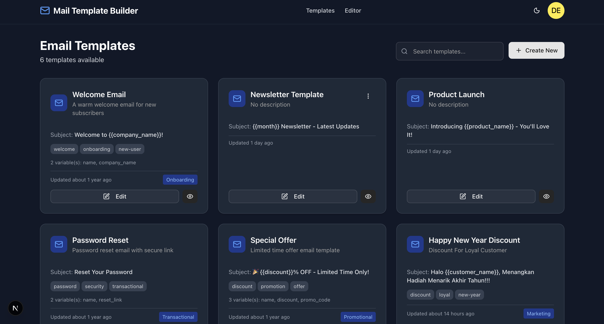

# Mail Template Builder

A modern, feature-rich email template builder designed for bulk email marketing campaigns. Built with Next.js 16, TypeScript, and powerful email editing capabilities.


## 📋 Overview

Mail Template Builder is a comprehensive web application that enables users to create, edit, and manage professional email templates for marketing campaigns. The application offers two powerful editing modes: a visual drag-and-drop editor and a rich text WYSIWYG editor, giving users the flexibility to choose their preferred workflow.

### Key Highlights

- 🎨 **Dual Editor Modes**: Choose between visual drag-and-drop (GrapeJS) or rich text editing (CKEditor 5)
- 🌓 **Dark Mode**: Full dark mode support with automatic system detection
- 📱 **Responsive Design**: Works seamlessly across desktop and mobile devices
- 🔐 **Authentication**: Secure user authentication system
- 💾 **File-based Storage**: Simple JSON-based template storage
- 🎯 **Merge Tags**: Support for dynamic variables like `{{name}}`, `{{email}}`, `{{company}}`
- 📤 **Export Functionality**: Export templates as standalone HTML files
- 👁️ **Live Preview**: Real-time preview of your email templates

## 📸 Screenshots

### Homepage

*Clean and modern landing page with clear call-to-action*

### Templates Management

*Organize and manage all your email templates in one place*

### Email Editor Interface

*Powerful dual-mode editor with visual and rich text editing capabilities*

### Dark Mode Support

*Full dark mode support with automatic system detection*

## ✨ Features

### Template Management
- **Create & Edit**: Build email templates from scratch or edit existing ones
- **Categorization**: Organize templates by category (Newsletter, Marketing, Transactional, etc.)
- **Tagging System**: Add custom tags for easy filtering and organization
- **Duplicate Templates**: Quickly create copies of existing templates
- **Search & Filter**: Find templates quickly with built-in search functionality

### Visual Editor (GrapeJS)
- **Drag & Drop Components**: 12+ pre-built email components
  - Header, Text, Button, Image
  - Divider, Footer, Column layouts
  - Merge tag blocks for personalization
- **Style Customization**: Full control over colors, fonts, spacing
- **Email-optimized**: Components designed specifically for email clients
- **Font Awesome Icons**: Built-in icon support for better UI

### Rich Text Editor (CKEditor 5)
- **WYSIWYG Editing**: What you see is what you get
- **Image Upload**: Base64 inline image encoding (no server storage needed)
- **Rich Formatting**: Bold, italic, underline, strikethrough, colors
- **Tables & Lists**: Create structured content with tables and lists
- **Source Editing**: Switch to HTML source code view
- **Media Embed**: Embed external media content
- **Special Characters**: Insert symbols and special characters

### User Interface
- **Modern Design**: Clean, intuitive interface built with Tailwind CSS v4
- **Dark Mode**:
  - Light theme
  - Dark theme
  - System auto-detection
  - Persistent theme preference
- **Responsive Layout**: Optimized for all screen sizes
- **shadcn/ui Components**: Beautiful, accessible UI components

### Authentication & User Management
- **Secure Login**: Email and password authentication
- **Protected Routes**: Automatic redirection for unauthenticated users
- **User Profile**: View and manage account information
- **Persistent Sessions**: Stay logged in across browser sessions

## 🛠️ Tech Stack

### Frontend
- **[Next.js 16.0.0](https://nextjs.org/)** - React framework with App Router
- **[TypeScript 5.x](https://www.typescriptlang.org/)** - Type-safe JavaScript
- **[Tailwind CSS v4](https://tailwindcss.com/)** - Utility-first CSS framework
- **[React 19](https://react.dev/)** - UI library

### Editors
- **[GrapeJS 0.22.13](https://grapesjs.com/)** - Visual drag-and-drop editor
- **[CKEditor 5 47.1.0](https://ckeditor.com/)** - Rich text WYSIWYG editor

### State Management
- **[Zustand 5.0.2](https://zustand-demo.pmnd.rs/)** - Lightweight state management
- **[zustand/middleware](https://github.com/pmndrs/zustand)** - Persistence middleware

### UI Components
- **[shadcn/ui](https://ui.shadcn.com/)** - Reusable component library
- **[Radix UI](https://www.radix-ui.com/)** - Accessible primitives
- **[Lucide React](https://lucide.dev/)** - Icon library

### Utilities
- **[date-fns](https://date-fns.org/)** - Date manipulation
- **[react-hot-toast](https://react-hot-toast.com/)** - Toast notifications
- **[Font Awesome](https://fontawesome.com/)** - Icons for editor blocks

## 🚀 Getting Started

### Prerequisites

- **Node.js**: 18.x or higher
- **npm**: 9.x or higher (or yarn/pnpm/bun)

### Installation

1. **Clone the repository**
   ```bash
   git clone <repository-url>
   cd mail-template-builder
   ```

2. **Install dependencies**
   ```bash
   npm install
   # or
   yarn install
   # or
   pnpm install
   ```

3. **Set up environment variables**
   ```bash
   cp .env.example .env.local
   ```

4. **Configure CKEditor license key** (optional)

   Edit `.env.local`:
   ```env
   # For GPL (open source) usage - default
   NEXT_PUBLIC_CKEDITOR_LICENSE_KEY=GPL

   # For commercial usage - add your license key
   # NEXT_PUBLIC_CKEDITOR_LICENSE_KEY=your-license-key-here
   ```

5. **Run the development server**
   ```bash
   npm run dev
   ```

6. **Open your browser**

   Navigate to [http://localhost:3000](http://localhost:3000)

### First Time Setup

1. **Access the login page**: Navigate to `/login`
2. **Use demo credentials**:
   - Email: `demo@example.com`
   - Password: `demo123`
3. **Start creating templates**: Click "Create New" to begin

## 📁 Project Structure

```
mail-template-builder/
├── src/
│   ├── app/                      # Next.js App Router pages
│   │   ├── api/                  # API routes
│   │   │   ├── templates/        # Template CRUD operations
│   │   │   └── upload/           # File upload endpoint
│   │   ├── editor/               # Email editor page
│   │   ├── login/                # Login page
│   │   ├── profile/              # User profile page
│   │   ├── templates/            # Templates listing page
│   │   ├── layout.tsx            # Root layout with ThemeProvider
│   │   ├── page.tsx              # Homepage
│   │   └── globals.css           # Global styles with dark mode
│   │
│   ├── components/               # React components
│   │   ├── auth/                 # Authentication components
│   │   │   ├── Navbar.tsx        # Navigation with dark mode toggle
│   │   │   ├── ProtectedRoute.tsx
│   │   │   └── UserMenu.tsx
│   │   ├── editor/               # Editor components
│   │   │   ├── EmailEditor.tsx   # GrapeJS wrapper
│   │   │   ├── CKEditorComponent.tsx  # CKEditor wrapper with dark mode
│   │   │   └── EditorToolbar.tsx # Editor controls
│   │   ├── templates/            # Template management components
│   │   │   ├── TemplateCard.tsx  # Template display card
│   │   │   ├── TemplateGrid.tsx  # Template grid layout
│   │   │   └── DeleteTemplateDialog.tsx
│   │   ├── ui/                   # shadcn/ui components
│   │   ├── DarkModeToggle.tsx    # Dark mode switcher
│   │   └── ThemeProvider.tsx     # Theme context provider
│   │
│   ├── hooks/                    # Custom React hooks
│   │   └── useDarkMode.ts        # Dark mode logic
│   │
│   ├── stores/                   # Zustand stores
│   │   ├── authStore.ts          # Authentication state
│   │   └── editorStore.ts        # Editor state
│   │
│   ├── types/                    # TypeScript type definitions
│   │   └── template.ts           # Template interfaces
│   │
│   └── lib/                      # Utility functions
│       └── utils.ts              # Helper functions
│
├── public/                       # Static assets
│   └── uploads/                  # Upload directory
│       └── images/               # Image uploads
│
├── data/                         # JSON data storage
│   ├── users.json                # User data
│   └── templates.json            # Template data
│
├── docs/                         # Documentation
│   ├── DUAL_EDITOR_MODE.md       # Editor modes guide
│   ├── CKEDITOR_IMPLEMENTATION.md
│   ├── CKEDITOR_API_KEY_SETUP.md
│   └── IMAGE_UPLOAD_GUIDE.md
│
├── .env.example                  # Environment variables template
├── .env.local                    # Local environment config
├── .gitignore                    # Git ignore rules
├── package.json                  # Dependencies
├── tsconfig.json                 # TypeScript config
├── tailwind.config.ts            # Tailwind configuration
└── next.config.ts                # Next.js configuration
```

## 🎨 Usage Guide

### Creating a New Template

1. **Navigate to Templates Page**: Click "Templates" in the navigation
2. **Create New**: Click the "Create New" button
3. **Choose Editor Mode**: Select "Drag & Drop" or "Rich Text" from the toolbar
4. **Design Your Email**:
   - Drag components from the sidebar (Drag & Drop mode)
   - Or use formatting tools (Rich Text mode)
5. **Configure Settings**: Click the template name to set:
   - Template name
   - Email subject
   - Description
   - Category
   - Tags
6. **Save**: Click "Save" when finished

### Using Merge Tags

Add dynamic content to your emails with merge tags:

- `{{name}}` - Recipient's name
- `{{email}}` - Recipient's email
- `{{company}}` - Company name
- `{{date}}` - Current date
- `{{url}}` - Custom URL

Insert merge tags by:
- Dragging merge tag blocks (Drag & Drop mode)
- Typing directly in the content (Rich Text mode)

### Switching Editor Modes

1. **Click the mode toggle** in the toolbar
2. **Content syncs automatically** between modes
3. **Choose your preferred workflow**:
   - **Drag & Drop**: Component-based design
   - **Rich Text**: Content-first editing

### Exporting Templates

1. **Open the template** in the editor
2. **Click "Export"** in the toolbar
3. **HTML file downloads** with embedded styles
4. **Use the file** in your email marketing platform

### Preview Templates

1. **Click "Preview"** in the toolbar
2. **Opens in new window** with live rendering
3. **Test responsiveness** by resizing the window

### Using Dark Mode

1. **Click the theme toggle** in the navbar (sun/moon icon)
2. **Choose your preference**:
   - **Light**: Always use light theme
   - **Dark**: Always use dark theme
   - **System**: Follow OS preference
3. **Preference is saved** automatically

## ⚙️ Configuration

### Environment Variables

Create a `.env.local` file in the root directory:

```env
# CKEditor Configuration
NEXT_PUBLIC_CKEDITOR_LICENSE_KEY=GPL

# For GPL license (free, open source): use "GPL"
# For commercial license: add your license key
```

### Dark Mode

Dark mode is configured in `src/app/globals.css` with CSS custom properties:

```css
@custom-variant dark (&:is(.dark *));

:root {
  --background: oklch(1 0 0);
  --foreground: oklch(0.145 0 0);
  /* ... light theme variables */
}

.dark {
  --background: oklch(0.145 0 0);
  --foreground: oklch(0.985 0 0);
  /* ... dark theme variables */
}
```

### Storage

Templates and user data are stored in JSON files:

- `data/users.json` - User accounts
- `data/templates.json` - Email templates

For production, consider migrating to a database like:
- PostgreSQL
- MongoDB
- MySQL

## 🧪 Development

### Available Scripts

```bash
# Development server
npm run dev

# Production build
npm run build

# Start production server
npm start

# Linting
npm run lint

# Type checking
npm run type-check
```

### Adding New Components

1. **Create component file** in `src/components/`
2. **Use TypeScript** for type safety
3. **Follow naming conventions**: PascalCase for components
4. **Add dark mode classes**: Use `dark:` prefix
5. **Export from index**: For easier imports

### Code Style Guidelines

- **Use TypeScript** for all new files
- **Functional components** with hooks
- **Tailwind CSS** for styling
- **ESLint** for code quality
- **Prettier** for formatting

## 🚢 Deployment

### Vercel (Recommended)

1. **Push code to GitHub**
2. **Import project to Vercel**
3. **Configure environment variables**
4. **Deploy automatically**

[](https://vercel.com/new)

### Other Platforms

The app can be deployed to any Node.js hosting platform:

- **Netlify**: With Next.js plugin
- **AWS Amplify**: With SSR support
- **Docker**: Use included Dockerfile (if added)
- **Self-hosted**: Run `npm run build && npm start`

### Build Optimization

```bash
# Production build
npm run build

# Analyze bundle size
npm run build -- --analyze
```

## 📚 Documentation

Additional documentation is available in the `docs/` directory:

- **[Dual Editor Mode](docs/DUAL_EDITOR_MODE.md)** - Guide to using both editors
- **[CKEditor Implementation](docs/CKEDITOR_IMPLEMENTATION.md)** - Technical details
- **[API Key Setup](docs/CKEDITOR_API_KEY_SETUP.md)** - License configuration
- **[Image Upload Guide](docs/IMAGE_UPLOAD_GUIDE.md)** - Base64 image handling

## 🤝 Contributing

Contributions are welcome! Please follow these steps:

1. **Fork the repository**
2. **Create a feature branch**: `git checkout -b feature/amazing-feature`
3. **Commit changes**: `git commit -m 'Add amazing feature'`
4. **Push to branch**: `git push origin feature/amazing-feature`
5. **Open a Pull Request**

### Development Guidelines

- Write clean, readable code
- Add TypeScript types for all functions
- Include dark mode support for UI components
- Test on multiple browsers
- Update documentation as needed

## 🐛 Known Issues

- **GrapeJS Dark Mode**: GrapeJS editor doesn't fully support dark mode (requires custom CSS overrides)
- **File Storage**: JSON-based storage not suitable for large-scale production
- **Image Storage**: Base64 encoding increases email size (consider external hosting for production)

## 🛣️ Roadmap

Future improvements planned:

- [ ] Database integration (PostgreSQL/MongoDB)
- [ ] Image hosting service integration
- [ ] Template versioning and history
- [ ] Collaboration features (sharing, comments)
- [ ] A/B testing for templates
- [ ] Email sending integration (SendGrid, Mailchimp)
- [ ] Template marketplace
- [ ] Multi-language support
- [ ] Mobile app (React Native)
- [ ] API documentation with OpenAPI/Swagger

## 📄 License

This project is open source and available under the [MIT License](LICENSE).

## 🙏 Acknowledgments

- **Next.js Team** - Amazing React framework
- **Vercel** - Hosting and deployment platform
- **GrapeJS** - Visual email editor
- **CKEditor** - Rich text editor
- **shadcn** - Beautiful UI components
- **Tailwind Labs** - Utility-first CSS framework

## 📞 Support

For support and questions:

- **Issues**: [GitHub Issues](https://github.com/shoelfikar/mail-template-builder/issues)
- **Discussions**: [GitHub Discussions](https://github.com/shoelfikar/mail-template-builder/discussions)
- **Email**: sulfikardi25@gmail.com

## 🌟 Show Your Support

If you find this project helpful, please give it a ⭐️ on GitHub!

---

**Built with ❤️ using Next.js, TypeScript, and Tailwind CSS**
